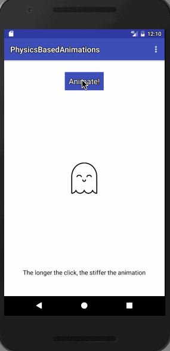
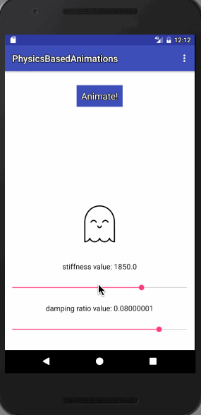

sample project to see what Android's new Physics based animation api can do 

https://developer.android.com/guide/topics/graphics/physics-based-animation.html

The first example creates a bounce effect based on how long the button was clicked. The longer the click, the more pressure is applied to the bounce.

The second example allows you to adjust the damp ratio and stiffness of the animation so you can see how the values affect the final outcome.

